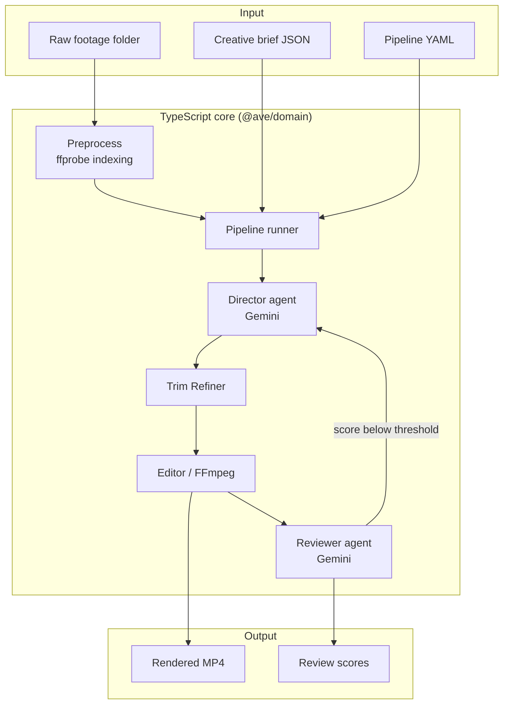
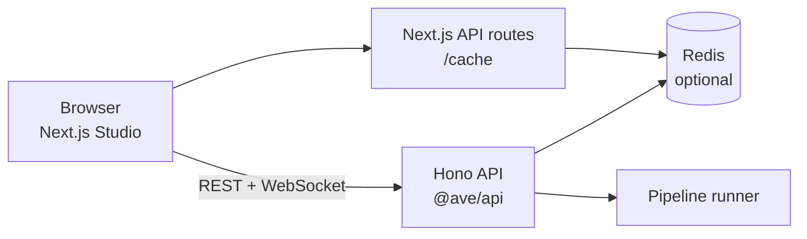

# Agentic Video Editor

Production-oriented fork of an AI-assisted video pipeline. Feed raw footage and a creative brief; a coordinated agent ensemble handles shot selection, trimming, rendering, and quality review.

The **CLI** is the primary, fully supported interface. **AVE Studio** (Next.js + Hono API) provides an experimental non-linear editor shell with optional Redis-backed persistence.

Built as a **TypeScript monorepo** (`apps/` + `packages/`) with shared infrastructure in `@ave/core` (config, logging, errors, Redis, Zod schemas).

---

## Feature Highlights

| Capability | Description |
|------------|-------------|
| Agent pipeline | Director, Trim Refiner, Editor, and Reviewer orchestrated from YAML manifests |
| Preprocessing | Footage indexing via ffprobe (scene detection / transcription are planned enhancements) |
| Retry loop | Reviewer-driven quality gate with configurable thresholds and versioned outputs |
| Style templates | Structured YAML guidance for pacing, overlays, and segment structure |
| AVE Studio | Web UI with timeline, monitors, inspector, and live job streaming |
| Persistence | Optional Redis layer for job snapshots and Studio cache |
| Configurable security | CORS and filesystem browse roots controlled via environment variables |

---

## Architecture



### Web stack



---

## Installation

### Prerequisites

- Node.js 20+
- FFmpeg on `PATH`
- [Google AI API key](https://aistudio.google.com/apikey)
- Redis 7+ (optional, for persistence)

### Setup

```bash
git clone https://github.com/your-org/agentic-video-editor.git
cd agentic-video-editor

npm install
cp .env.example .env
# Edit GOOGLE_API_KEY and optional Redis settings
```

Environment variables are loaded automatically by the CLI, API, and Studio.

---

## Configuration

| Variable | Default | Purpose |
|----------|---------|---------|
| `GOOGLE_API_KEY` | — | Required for Gemini agents |
| `AVE_LOG_LEVEL` | `info` | Logging verbosity |
| `AVE_OUTPUT_DIR` | `output` | Render output directory |
| `AVE_CORS_ORIGINS` | `http://localhost:3000,...` | Allowed browser origins |
| `AVE_BROWSE_ROOTS` | `~` | Comma-separated roots for `/api/browse` |
| `REDIS_ENABLED` | `true` | Toggle Redis features |
| `REDIS_URL` | `redis://127.0.0.1:6379` | Redis connection URL |
| `REDIS_KEY_PREFIX` | `ave:` | Key namespace prefix |
| `PORT` | `8000` | Hono API listen port |
| `NEXT_PUBLIC_API_URL` | `` | Override API base URL in Studio |

See `.env.example` for the full list including Redis tuning options.

---

## Usage (CLI)

```bash
npm run dev:cli -- edit \
  --footage-dir /path/to/footage \
  --brief '{"product": "My Product", "audience": "Women 25-45", "tone": "authentic", "duration_seconds": 30}' \
  --pipeline pipelines/ugc-ad.yaml \
  --style styles/dtc-testimonial.yaml
```

Briefs may be inline JSON or a path to a `.json` file. Outputs land in `output/` with versioned filenames when the reviewer triggers retries.

### Creative brief schema

```json
{
  "product": "Product name",
  "audience": "Target demographic",
  "tone": "energetic, calm, professional",
  "duration_seconds": 30,
  "style_ref": "styles/dtc-testimonial.yaml"
}
```

---

## Development

### Run the CLI

```bash
npm run dev:cli -- edit --footage-dir ./footage --brief brief.json
```

### Run AVE Studio

Terminal 1 — API:

```bash
npm run dev:api
```

Terminal 2 — Studio:

```bash
npm run dev:studio
```

Open http://localhost:3000

### Quality commands

```bash
npm run validate          # typecheck + lint + test + build (all workspaces)
npm run typecheck
npm run lint
npm run test
npm run build
```

On Windows, `scripts/validate.ps1` runs the same checks.

---

## Testing

| Suite | Scope |
|-------|-------|
| `npm test` (root) | Vitest unit tests under `tests/unit/` |
| Studio lint | ESLint + TypeScript in `@ave/studio` |

Core pipeline integration tests are intentionally deferred — they require Gemini credentials and FFmpeg fixtures.

---

## Project Structure

```
agentic-video-editor/
├── apps/
│   ├── api/                 # Hono REST + WebSocket (@ave/api)
│   └── studio/              # Next.js frontend (@ave/studio)
├── packages/
│   ├── core/                # Config, logging, errors, Redis, schemas
│   ├── domain/              # Pipeline, agents, FFmpeg tools
│   └── cli/                 # `ave` CLI entry point
├── pipelines/               # YAML pipeline manifests
├── styles/                  # Director style templates
├── tests/unit/              # Vitest unit tests
├── docs/internal/           # Maintainer audit notes
└── scripts/                 # validate.ps1 / validate.sh
```

Structure decisions are documented in `docs/internal/STRUCTURE.md`.

---

## Troubleshooting

| Symptom | Likely cause | Fix |
|---------|--------------|-----|
| `GOOGLE_API_KEY` errors | Missing or invalid key | Set in `.env` or export in shell |
| Browse returns 403 | Path outside `AVE_BROWSE_ROOTS` | Add parent directory to roots |
| Redis unavailable | Server not running | Start Redis or set `REDIS_ENABLED=false` |
| FFmpeg not found | Binary not on PATH | Install FFmpeg and verify with `ffmpeg -version` |
| Studio cannot reach API | Wrong proxy target | Set `NEXT_PUBLIC_API_URL=http://localhost:8000` |

Check Redis connectivity from Studio:

```bash
curl http://localhost:3000/api/cache/status
```

---

## FAQ

**Is the web UI production-ready?**  
No. AVE Studio is experimental. Use the CLI for reliable workflows.

**Do I need Redis?**  
No. The app runs without Redis; persistence and cache features degrade gracefully.

**Can I add custom agents?**  
Implement an agent under `packages/domain/src/agents/` and reference it in a pipeline YAML manifest.

**How are retries versioned?**  
Each reviewer-triggered retry writes `{name}_v{N}.mp4` so you can compare iterations.

---

## Contributing

1. Fork the repository and create a feature branch.
2. Run `npm run validate`.
3. Keep commits focused; include tests for behavioral changes.
4. Open a pull request with a clear summary and test plan.

---

## License

MIT
